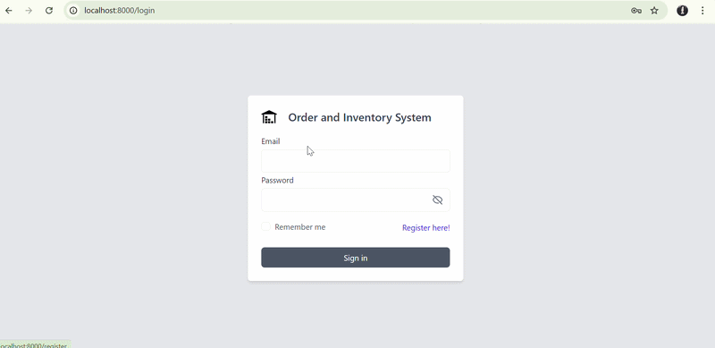

### Multi-user order and inventory system

---

## 📦 Installation

### 1. Clone the repository

```bash
git clone https://github.com/withzeus/inventory_system.git
cd inventory_system
```

### 2. Install dependencies

```bash
composer install
npm install
```

### 3. Copy `.env` file

```bash
cp .env.example .env
```

### 4. Generate application key

```bash
php artisan key:generate
```

### 5. Update database and app settings:

```env
APP_NAME=LaravelApp
APP_URL=http://localhost

DB_CONNECTION=mysql
DB_HOST=127.0.0.1
DB_PORT=3306
DB_DATABASE=your_db
DB_USERNAME=your_user
DB_PASSWORD=your_password
```

### 6. Database Setup

```bash
php artisan db:seed
```

### 7. Frontend build

```bash
For development:
    npm run dev
For Production:
    npm run build
```

### 8. Running the application

```bash
php artisan serve
```


